# Module 03 - Dịch vụ Compute VM trên AWS
- AWS Elastic Compute Cloud (EC2)
- Amazon Lightsail
- Amazon EFS / FSX
- AWS Application Migration Service (MGN)
---
## Module 03 - 01 - Amazon Elastic Compute Cloud (EC2)
## 01 - **Theory**
  - **Amazon EC2** giống với máy chủ ảo hoặc máy chủ vật lí truyền thống. EC2 có khả năng **khởi tạo nhanh, khả năng co dãn tài nguyên mạnh mẽ** (**Elasticity**)
    - Có thể thay đổi, thêm bớt tài nguyên so với máy chủ truyền thống -> Nhiều người mở thêm máy chủ ảo, Ít người tắt bớt đi -> Tối ưu chi phí
    - Có thể nâng cấp cấu hình thuận tiện hơn máy chủ truyền thống -> Tuỳ theo tình hình, nhu cầu khách hàng có thể nâng cấp mở rộng trong thời gian ngắn
  - Amazon EC2 có thể đáp ứng workload hay bất cứ công việc nào mà máy chủ truyền thống làm được
## 02 - **SetUp**
  - Cấu hình của Amazon EC2 không được tuỳ chọn tuỳ ý, mà lựa chọn cấu hình thông qua việc lựa chọn các EC2 Instance type.
  - Instance type quyết định các yếu tố:
    - CPU (Intel/AMD/ARM (**Graviton 1/2/3**)) / GPU
    - Memory
    - Network
    - Storage
## 03 - **Kiến trúc EC2**
  - Hardware Node (Thiết bị phần cứng) sẽ được lựa chọn và quản lí bởi AWS dựa theo thông tin khởi tạo EC2 (Instace Type, Placement Option, Hypervisor, AZ)
    - Placement Option: cho phép nhiều EC2 nằm trên 1 HardwareNode để giảm latency, hoặc khác nhau để tránh tình huống ảnh hưởng lẫn nhau.  
  - Hypervisor (Nằm trên Hardware Node) đóng vai trò quản lí phần cứng, được lựa chọn lúc ta chọn Amazon Machine Image (Template) -> Khởi tạo máy ảo (như ổ C:/)
    - KVM - Nitro mới nhất có tốc độ nhanh hơn 30% (> HVM - Hardware Virtual Machine; PV - Paravirtualization)
  - EC2 (nằm trên lớp Hypervisor) là các máy chủ ảo có thuật ngữ là **EC2 Instances** thay vì Virtual Machine.
    - Không đánh đồng hiệu năng trên Cloud, hay so sánh cấu hình với On-Premise -> Cần chạy đánh giá hiệu năng thực tế 

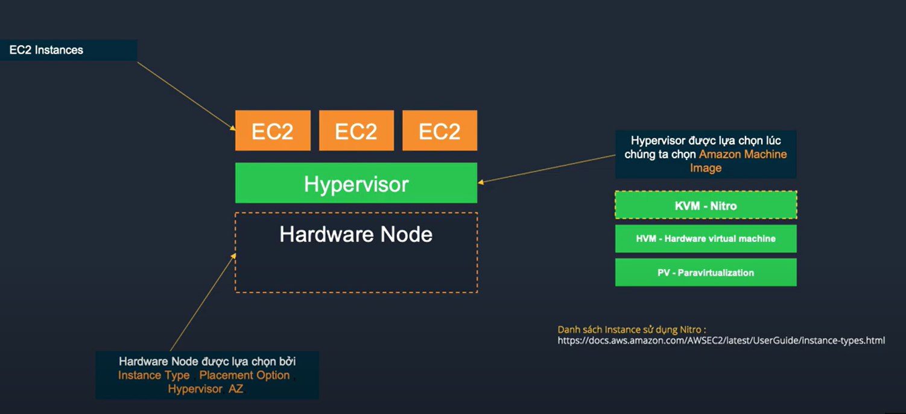

## 04 - **AMI/Backup/Keypair**
  - Amazon Machine Image (AMI): có thể provision ra một hoặc nhiều EC2 Instances cùng lúc
    - AMI có sẵn của AWS trên AWS market place và custom AMI tự tạo từ EC2 Instances
    - AMI bao gồm root OS volumes, quyền sử dụng AMI quy định tài khoàn AWS được sử dụng và mapping EBS volume được tạo và gán vào EC2 Instances
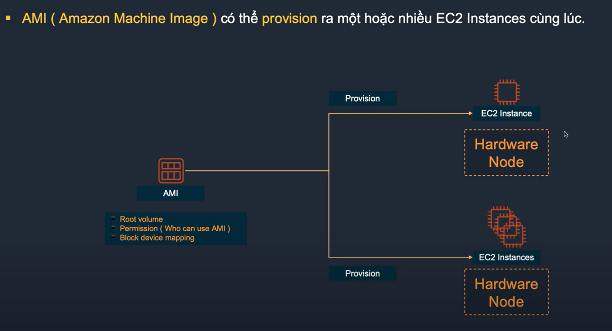 
  - EC2 Instance có thể được **backup** bằng cách tạo **snapshot**:
    - Snapshot đầu tiên full snapshot
    - Snapshot thứ 2 trở đi sẽ là incremental snapshot (chỉ lấy những cái thay đổi trên volume đó)
  - **Key pair** (public key và private key): dùng để mã hóa thông tin đăng nhập cho EC2 Instance

## 05 - **Elastic Block Store**
  - **Amazon EBS** cung cấp block storage và được gán trực tiếp vào EC2 Instance
    - Tuy được gán trực tiếp như 1 RAW device thì EBS bản chất hoạt động động lập với EC2 và được kết nối thông qua mạng riêng của EBS
  - EBS có 2 nhóm đĩa chính là HDD và SSD được thiết kế để đạt độ sẵn sàng ~ 99.9% bằng cách replicate dữ liệu giữa 3 storage node trong 1 AZ
    - HDD: ưu tiên với việc đọc ghi tuần tự
    - SSD: lưu trữ dạng flash, hỗ trợ đọc ghi ngẫu nhiên cao

  - Một số EC2 Instances đặc thù được tối ưu hóa hiệu năng của EBS (Optimized EBS Instances)
  - EBS volumes mặc định chỉ được gán vào 1 EC2 Instances
    - Tuy nhiên EC2 chạy trên **Hypervisor Nitro** có thể dùng 1 EBS volume gắn vào nhiều EC2 (EBS Multi attach)
  - EBS được backup bằng cách thực hiện snapshot vào S3 (Simple storage storage)

## 06 - **Instance Store**
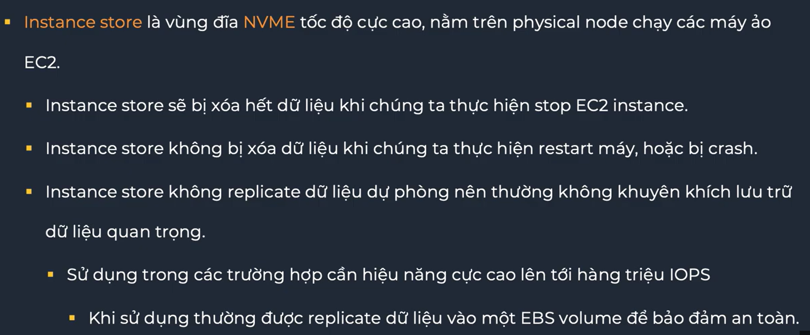

## 07 - **User Data**
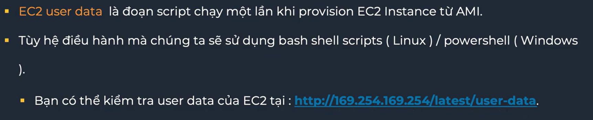
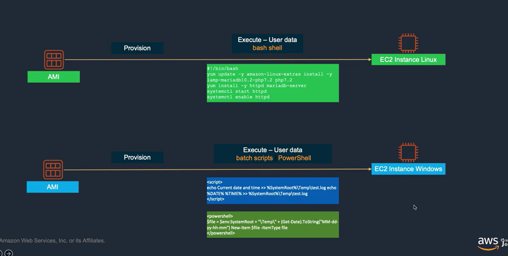

## 08 - **Meta Data**
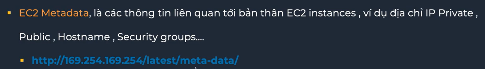
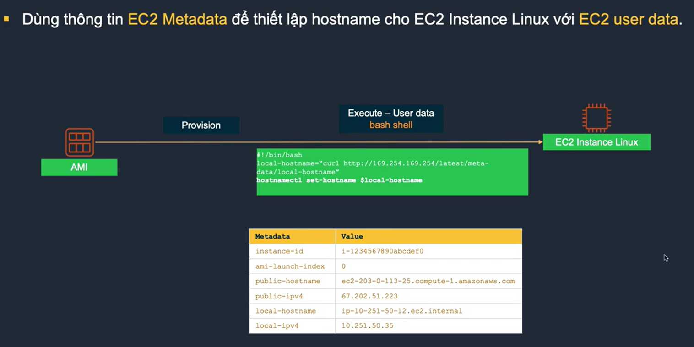

## 09 - **EC2 Auto Scaling**
  - EC2 Auto Scaling là tính năng hỗ trợ tăng giảm lượng EC2 Instances dựa theo các điều kiện cụ thể (scaling policy)
  - EC2 Auto Scaling có thể tự đăng ký các EC2 Instance vào Elastic Load Balancer
  - EC2 Auto Scaling hoạt động trên nhiều AWS Availability Zone
  - EC2 Auto Scaling có thể hỗ trợ nhiều **Pricing Options** khác nhau
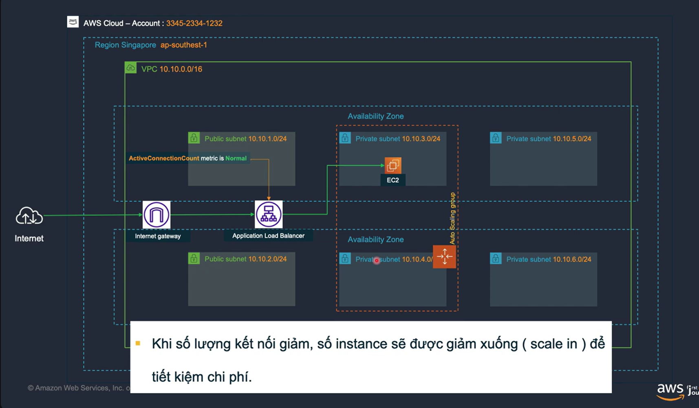 

 ## 10 - **Pricing Options**
  - **On-demand**: Trả theo giờ / phút / giây, xài nhiêu tính nhiêu, mắc nhất. Phù hợp cho các workload chạy lên tới 6 tiếng 1 ngày.
  - **Reserved Instance**: Cam kết sử dụng theo kì hạn 1-3 năm để lấy discount, tuy nhiên bị giới hạn theo EC2 Instance type family.
  - **Saving Plans**: Cam kết sử dụng theo kì hạn 1-3 năm để lấy discount, có thể không bị giới hạn bởi EC2 Instance type family.
  - **Spot Instance**: Tận dụng tài nguyên dư, giá rẻ tuy nhiên khi cần thì AWS sẽ terminate instance trong 2 phút.
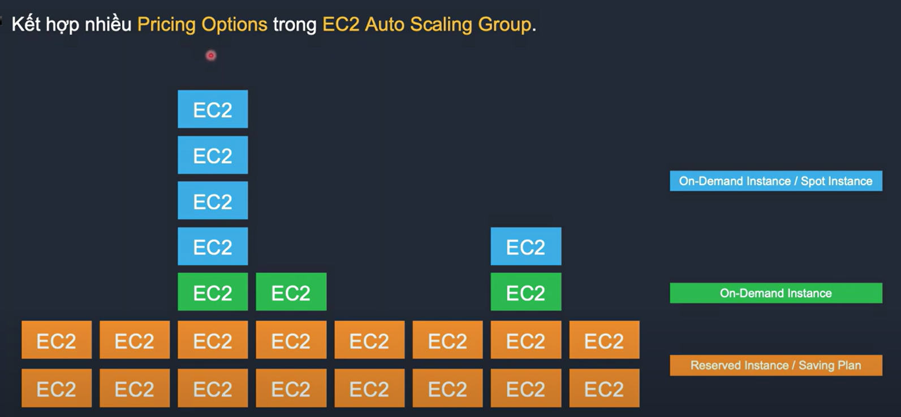

## 11 - **Amazon LightSail**
  - Amazon Lightsail là dịch vụ tính toán có chi phí thấp (giá tính theo tháng chỉ bắt đầu từ 3.5$ / tháng) ngoài ra mỗi Instance Lightsail tạo ra cũng sẽ có một mức data transfer đi kèm.(data transfer này có mức giá rẻ hơn data transfer từ EC2 tương đối nhiều)
  - Amazon Lightsail phù hợp cho các workload nhẹ, môi trường test dev, không yêu cầu tải CPU cao liên tục > 2 giờ mỗi ngày.
  - Amazon Lightsail cũng có khả năng backup bằng snapshot tương tự EC2.
  - Amazon Lightsail chạy trong một VPC đặc biệt, có thể kết nối tới VPC thông thường qua 1 click VPC Peering.
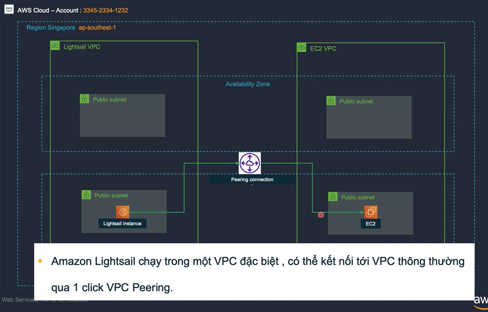

## 12 - **Amazon EFS**
  - EFS (Elastic File System) cho phép tạo các NFSv4 Network volume và gán vào nhiều EC2 Instances cùng lúc, quy mô lưu trữ lên đến hàng petrabyte.
  - **EFS chỉ hỗ trợ Linux**.
  - Sử dụng EFS chỉ tính chi phí theo dung lượng sử dụng (trong khi EBS tính phí theo dung lượng cấp phát).
  - EFS có thể được cấu hình để mount vào môi trường on-premise qua DX hoặc VPN.
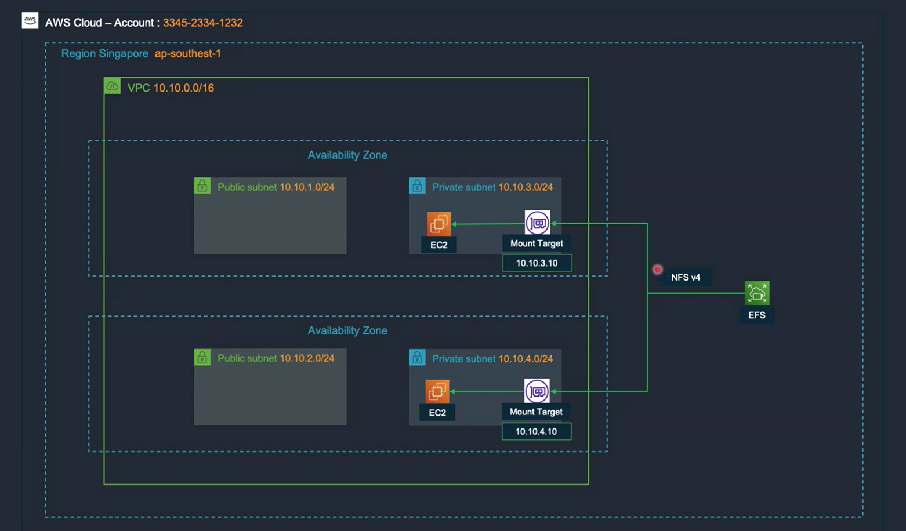

## 13 - **Amazon FSX**
  - FSx cho phép tạo các NTFS volume và gán vào nhiều EC2 Instances cùng lúc sử dụng giao thức SMB (Server Message Block).
  - **FSx hỗ trợ cho Windows và Linux**
  - Sử dụng FSx chỉ tính chi phí theo dung lượng sử dụng (trong khi EBS tính chi phí theo dung lượng cấp phát).
  - FSx hỗ trợ tính năng **deduplication**, giúp giảm chi phí 30-50% cho các trường hợp sử dụng thông thường.

## 14 - **AWS Application Migration Service(MGN)**
  - MGN dùng để migrate và replicate phục vụ mục đích xây dựng Disaster Recovery Site cho các máy chủ thực, ảo lên môi trường AWS.
  - MGN liên tục sao chép các máy chủ nguồn sang EC2 Instance trên tài khoản AWS (**asynchronous / syschronous**).
  - MGN trong quá trình sao chép sẽ sử dụng các máy staging có số lượng và quy mô cấu hình nhỏ hơn máy chủ gốc rất nhiều.
  - Khi thực hiện **cut-over** MGN sẽ tự động tạo và chạy các máy chủ EC2 trên AWS.
